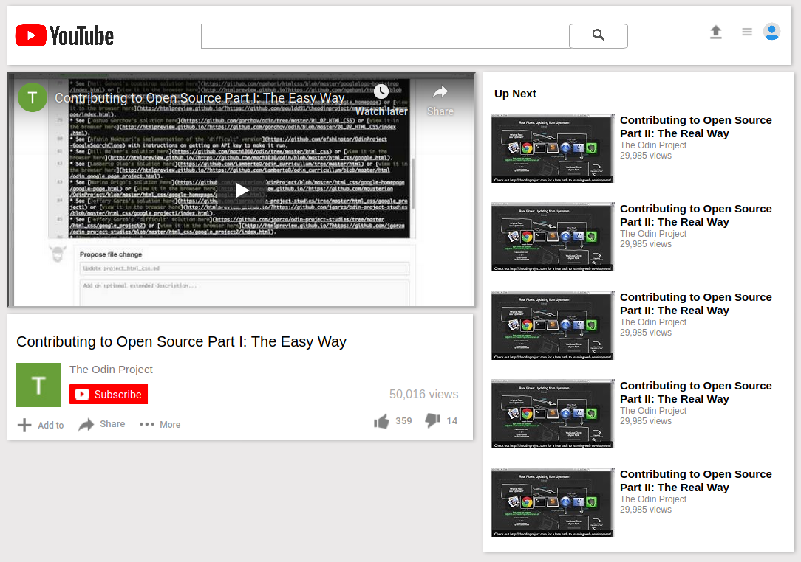

# Youtube Clone Page

> This project consists of building an HTML document that matches the appearance of [youtube video player page](http://archive.vn/Bss88).



## Built With

- HTML
- CSS

## Live Demo

[Live Demo Link](https://raw.githack.com/VanessaAoki/youtube-project/feature/index.html)


## Getting Started

To get a local copy up and running follow these simple example steps.

### Prerequisites

- Live Server plugin for Visual Studio Code 

### Setup

1- Clone the repository
```
git clone https://github.com/VanessaAoki/youtube-project
```

2- Open the folder on VS Code, right click the index.html file and click on "Open With Live Server"

3- Everything should be running by now. 


## Authors

👤 **Vanessa Aoki**

- GitHub: [@VanessaAoki](https://github.com/VanessaAoki)
- Twitter: [@VanessaSAoki](https://twitter.com/VanessaSAoki)
- Linkedin: [Vanessa Aoki](https://www.linkedin.com/in/vanessasaoki/)

👤 **Angela Cuahutle**

- GitHub: [@angelacuahutle](https://github.com/angelacuahutle)
- Twitter: [@AngelaCunaDev](https://twitter.com/AngelaCunaDev)

## 🤝 Contributing

Contributions, issues, and feature requests are welcome!

Feel free to check the [issues page](https://github.com/VanessaAoki/youtube-project/issues).

## Show your support

Give a ⭐️ if you like this project!

## 📝 License

This project is [MIT](https://github.com/VanessaAoki/youtube-project/blob/feature/LICENSE.txt) licensed.

